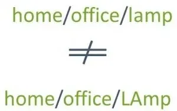
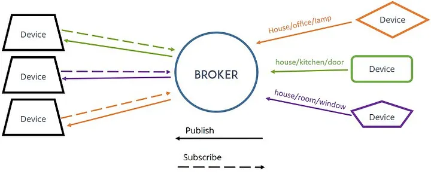

# MQTT

## Resurser

- <a href="https://medium.com/mindful-engineering/mqtt-aedes-broker-a036d607e5db">https://medium.com/mindful-engineering/mqtt-aedes-broker-a036d607e5db</a>
- <a href="https://www.hivemq.com/mqtt-essentials/">https://www.hivemq.com/mqtt-essentials/</a>
- <a href="https://superhussain.github.io/vue-joystick-component/#/story/stories-joystick-story-vue?variantId=_default">https://superhussain.github.io/vue-joystick-component/#/story/stories-joystick-story-vue?variantId=\_default</a>
- <a href="https://chrome.google.com/webstore/detail/mqttbox/kaajoficamnjijhkeomgfljpicifbkaf/related?pli=1">MQTT Box för att testa broker</a>
- <a href="https://www.youtube.com/watch?v=f4JmhGBsRkQ">https://www.youtube.com/watch?v=f4JmhGBsRkQ</a>

## Vad är MQTT

MQTT (Message Queuing Telemetry Transport) är ett kommunikationsprotokoll som används för att skicka meddelanden mellan enheter över nätverk, vanligtvis inom Internet of Things (IoT). Det är ett lättviktigt protokoll som är utformat för att vara energieffektivt och resursbesparande, vilket gör det lämpligt för anslutning av små enheter med begränsad kapacitet och bandbredd.

MQTT fungerar enligt en publisher/subscriber-modell där en enhet som genererar data (publisher) skickar data till en broker, som sedan distribuerar data till alla mottagare som har prenumererat på det specifika ämnet (topic) som datan är knuten till. Detta gör att enheterna inte behöver ha direktkontakt med varandra och kan skicka och ta emot meddelanden utan att veta om varandra.

MQTT är ett öppet protokoll och har blivit alltmer populärt för att skapa kommunikationslösningar inom IoT-området på grund av dess enkelhet, pålitlighet och skalförmåga.


## Mer om publisher/subscribe modellen

Som jag nämnde tidigare, är MQTT baserat på en publisher/subscriber-modell. Denna modell möjliggör kommunikation mellan flera enheter, där enheter kan agera som antingen en publisher eller en subscriber.

En publisher är en enhet som genererar data som ska skickas vidare till andra enheter. Denna data skickas vanligtvis till en centraliserad enhet kallad broker, som agerar som en mellanhand för att skicka datan vidare till alla enheter som prenumererar på det specifika ämnet (topic) som datan är knuten till.

En subscriber är en enhet som är intresserad av att ta emot data som har publicerats av en annan enhet. Subscribers prenumererar på specifika ämnen (topic) som intresserar dem och får datan skickad till dem via brokeren så snart den publicerats av en publisher.

Detta tillvägagångssätt gör att enheterna inte behöver ha direktkontakt med varandra och kan skicka och ta emot meddelanden utan att veta om varandra, vilket gör det lämpligt för IoT-applikationer där enheter kan vara utspridda över stora geografiska områden.

Det är värt att notera att en enhet kan både agera som en publisher och som en subscriber samtidigt, vilket möjliggör tvåvägskommunikation och att enheter kan skicka och ta emot meddelanden från flera källor samtidigt.


## Mer om topics

I MQTT, är en "topic" en sträng som används för att identifiera en kategori eller ett ämne som meddelanden kan publiceras eller prenumereras på. När en klient (antingen en publisher eller en subscriber) ansluter till en MQTT-broker, kan den prenumerera på en eller flera topics genom att ange en eller flera topic-strängar till brokern.

När en klient skickar ett meddelande till en topic, så distribueras meddelandet till alla klienter som har prenumererat på den specifika topicen. Meddelandena är vanligtvis strängar som innehåller data i ett specifikt format, beroende på applikationen som använder MQTT. Till exempel, i en IoT-applikation kan meddelandena innehålla sensor-data, som temperatur eller fuktighet, från en specifik enhet.

Det är viktigt att notera att MQTT-brokern inte behöver ha någon kunskap om innehållet i meddelandet, eftersom det är klienternas ansvar att bearbeta meddelanden som de prenumererar på. MQTT-brokern är endast ansvarig för att matcha meddelanden till topics och skicka dem till prenumeranterna.

För att sammanfatta, i MQTT är en topic en sträng som används för att identifiera ett ämne eller en kategori för meddelanden. Meddelanden är strängar som innehåller data i ett specifikt format, som distribueras av MQTT-brokern till alla prenumeranter på en given topic.



## Aedes.js Node.js broker

Aedes är en MQTT-broker som är skriven i Node.js och kan köras på en mängd olika plattformar, inklusive Windows, Linux och MacOS. För att använda Aedes-brokern i en Node.js-applikation, behöver du först installera aedes-paketet via npm (Node Package Manager).



Följande steg visar hur du kan installera och använda Aedes-brokern i en Node.js-applikation:

1. Installera Aedes-paketet via npm:

```bash
npm install aedes
```

2. Skapa en enkel Node.js-fil för att starta Aedes-brokern:

```js
const aedes = require("aedes")();
const server = require("net").createServer(aedes.handle);

server.listen(1883, function () {
  console.log("Aedes broker started and listening on port 1883");
});
```

Detta skapar en Aedes-brokerinstans och en TCP-server som lyssnar på port 1883.

3. Starta applikationen genom att köra Node.js-filen via terminalen:

```bash
node aedes-broker.js
```

Detta startar Aedes-brokern och gör den tillgänglig för enheter som vill ansluta till den.

4. Anslut enheter till Aedes-brokern genom att använda en MQTT-klient. Du kan använda en klient som MQTT.js för att ansluta till Aedes-brokern och skicka och ta emot meddelanden.

```js
const mqtt = require("mqtt");
const client = mqtt.connect("mqtt://localhost:1883");

client.on("connect", function () {
  console.log("Connected to Aedes broker!");
  client.subscribe("test-topic");
  client.publish("test-topic", "Hello, World!");
});

client.on("message", function (topic, message) {
  console.log(`Received message on topic ${topic}: ${message.toString()}`);
});
```

Detta skapar en MQTT-klient som ansluter till Aedes-brokern på localhost:1883 och prenumererar på ämnet "test-topic". Klienten skickar också ett meddelande till "test-topic" när den ansluter till brokern. När ett meddelande skickas till "test-topic" på brokern, kommer klienten att ta emot meddelandet och logga det i terminalen.

Detta är en grundläggande beskrivning av hur du kan använda Aedes-brokern för MQTT i en Node.js-applikation. Det finns många andra funktioner och inställningar som kan anpassas och konfigureras i Aedes-brokern beroende på dina behov.

## Mer info om Aedes brokern

Här är några exempel på vad du kan göra med Aedes-brokern:

- Konfigurera säkerhetsfunktioner: Aedes-brokern har inbyggda säkerhetsfunktioner som du kan använda för att skydda dina MQTT-anslutningar och meddelanden. Till exempel kan du konfigurera Aedes-brokern att kräva autentisering och/eller kryptering för anslutningar.

- Använda MQTT-TLS: Aedes-brokern kan användas tillsammans med MQTT-TLS (Transport Layer Security) för att kryptera kommunikationen mellan klienter och brokern.

- Spara meddelanden i en databas: Aedes-brokern kan konfigureras för att spara meddelanden i en databas, till exempel MongoDB eller Redis. Detta kan vara användbart för att spara data för senare användning eller analys.

- Använda händelsehanterare: Aedes-brokern stöder händelsehanterare som kan användas för att utföra åtgärder baserat på händelser som inträffar i brokern. Till exempel kan du konfigurera en händelsehanterare för att logga anslutningar eller meddelanden.

- Skala upp Aedes-brokern: Aedes-brokern kan skalas upp för att hantera tusentals eller miljontals anslutningar och meddelanden genom att använda flera instanser och en lastbalanserare.

- Använda Aedes-brokern tillsammans med andra tekniker: Aedes-brokern kan användas tillsammans med andra tekniker som Node-RED, ett flödesbaserat programmeringsverktyg för IoT-applikationer. Du kan använda Aedes-brokern för att hantera MQTT-kommunikationen mellan dina enheter och Node-RED för att bearbeta och hantera data.

Dessa är bara några exempel på vad du kan göra med Aedes-brokern. Aedes-brokern är en kraftfull och mångsidig MQTT-broker som kan anpassas och konfigureras för att passa dina specifika behov.
